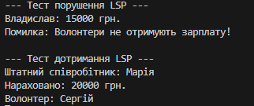

# Лабораторна робота №22: Принцип підстановки Лісков (LSP)

**Студент:** Прус Владислав  
**Група:** ІПЗ-3/1  
**Тема:** LSP: виявлення порушень і альтернативи

---

## 1. Мета роботи
Поглибити розуміння принципу підстановки Лісков (LSP), навчитися ідентифікувати його порушення в ієрархіях класів та застосовувати рефакторинг через інтерфейси для створення стабільного коду.

---

## 2. Початкова реалізація (Порушення LSP)

У початковій структурі клас `Volunteer` успадковується від `Employee`. Це створює проблему, оскільки волонтери не отримують заробітну плату, а контракт базового класу вимагає її розрахунку.

### Код із помилкою:
```csharp
public class Employee
{
    public string Name { get; set; }
    public virtual decimal CalculateSalary() => 15000m;
}

public class Volunteer : Employee
{
    public override decimal CalculateSalary()
    {
        // Порушення LSP: зміна очікуваної поведінки на виняток
        throw new NotSupportedException("Волонтери не отримують зарплату!");
    }
}

