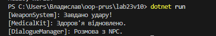

# Звіт з лабораторної роботи №23
**Тема:** ISP & DIP: рефакторинг і DI через конструктор

**Дисципліна:** Об'єктно-орієнтоване програмування

**Виконав:** студент групи ІПЗ-3/1 Прус Владислав

---

## 1. Мета роботи
Застосувати принципи розділення інтерфейсу (ISP) та інверсії залежностей (DIP) для рефакторингу існуючого коду, а також реалізувати Dependency Injection (DI) через конструктор для зменшення зв’язаності та покращення тестування.

---

## 2. Аналіз порушень у початковій структурі

До проведення рефакторингу в системі `HeroAction` були присутні наступні архітектурні помилки:

* **Порушення ISP (Interface Segregation Principle):** Клієнтський код (клас героя) залежав від одного великого інтерфейсу, що містив методи для атаки, лікування та діалогів одночасно. Це порушує принцип, оскільки не кожен персонаж у грі повинен володіти всіма цими функціями.
* **Порушення DIP (Dependency Inversion Principle):** Модуль високого рівня (`HeroAction`) самостійно створював екземпляри модулів нижчого рівня (`WeaponSystem`, `MedicalKit`). Це створювало жорстку прив'язку до конкретних реалізацій, що унеможливлювало швидку заміну функціоналу або проведення модульного тестування.

---

## 3. Опис виконаного рефакторингу

Для виправлення порушень було вжито наступні заходи:

1.  **Застосування ISP:** Великий інтерфейс було розділено на три вузькі: `IAttacker`, `IHealer` та `ITalker`. Тепер клас герою може використовувати лише ті інтерфейси, які йому дійсно потрібні.
2.  **Застосування DIP:** Клас `HeroAction` було переписано так, щоб він залежав від абстракцій (інтерфейсів), а не від конкретних класів.
3.  **Реалізація DI:** Впроваджено механізм Dependency Injection через конструктор. Тепер конкретні об'єкти (зброя, аптечка) створюються зовні та "впорскуються" в героя під час ініціалізації.

---

## 4. Результат виконання програми (Консольне виведення)

Після успішної компіляції та запуску проєкту `lab23`, консоль відображає роботу впроваджених залежностей:

