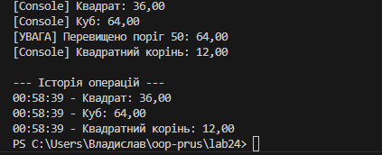

# Лабораторна робота №24: Патерни Strategy та Observer

## Опис проєкту
Даний проєкт демонструє поєднання двох поведінкових патернів проєктування: **Strategy** (Стратегія) та **Observer** (Спостерігач) на прикладі системи обробки числових даних.

### Реалізований функціонал:
1.  **Strategy**: Динамічна зміна математичних алгоритмів (Square, Cube, SquareRoot) для обробки чисел без зміни коду обробника.
2.  **Observer**: Система автоматичних сповіщень через події C# (`event Action`). При розрахунку результату всі підписані компоненти (консольний логгер, історія, сповіщувач про поріг) отримують дані автоматично.

---

## Структура коду
* `INumericOperationStrategy` — інтерфейс для алгоритмів.
* `NumericProcessor` — клас-контекст, що використовує стратегії.
* `ResultPublisher` — суб'єкт (Subject), що розсилає повідомлення.
* **Observers**:
    * `ConsoleLoggerObserver` — вивід у консоль.
    * `HistoryLoggerObserver` — збереження списку результатів.
    * `ThresholdNotifierObserver` — перевірка критичних значень.

---

## Результати виведення з консолі
