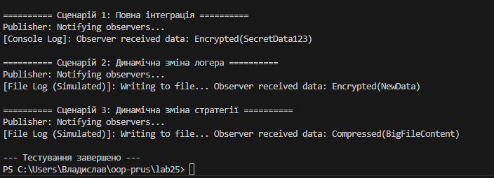

# Лабораторна робота №25: Інтеграція патернів проєктування
**Курс:** Об'єктно-орієнтоване програмування  
**Студент:** Прус Владислав, група ІПЗ-3/1

---

## 1. Мета роботи
Метою роботи є розробка інтегрованої системи на мові C#, що демонструє взаємодію між компонентами, які реалізують патерни **Factory Method**, **Singleton**, **Strategy** та **Observer**. Головна задача — переконатися у коректності спільної роботи цих патернів та можливості їх динамічної зміни.

---

## 2. Опис реалізованих патернів

У проєкті використано чотири фундаментальні патерни:

| Патерн | Тип | Опис реалізації у проєкті |
| :--- | :--- | :--- |
| **Singleton** | Твірний | Клас `LoggerManager`, що забезпечує єдину точку доступу до логування. |
| **Factory Method** | Твірний | Абстрактна фабрика `LoggerFactory` та її реалізації для створення різних типів логерів. |
| **Strategy** | Поведінковий | Інтерфейс `IDataProcessorStrategy`, що дозволяє змінювати алгоритм обробки (Encryption/Compression). |
| **Observer** | Поведінковий | Механізм подій (`EventHandler`), що сповіщає `ProcessingLoggerObserver` про завершення обробки. |

---

## 3. Структура проєкту та взаємодія

Проєкт реалізує гнучку систему обробки даних:
1. **DataContext** виконує обробку рядка за обраною **Strategy**.
2. Після обробки **DataPublisher** генерує подію.
3. **Observer** отримує дані з події та передає їх у **LoggerManager**.
4. **LoggerManager (Singleton)** використовує об'єкт логера, створений через **Factory Method**, для виводу повідомлення.

---

## 4. Демонстрація сценаріїв

Програма виконує три основні сценарії тестування:

### Сценарій 1: Повна інтеграція
* **Логер:** ConsoleLogger (через фабрику).
* **Стратегія:** EncryptDataStrategy.
* **Результат:** Дані шифруються, спостерігач реагує на подію, логер виводить результат у консоль.

### Сценарій 2: Динамічна зміна логера
* **Дія:** Заміна `ConsoleLoggerFactory` на `FileLoggerFactory`.
* **Результат:** Система логування змінює свою поведінку "на льоту" без перезапуску програми.

### Сценарій 3: Динамічна зміна стратегії
* **Дія:** Заміна `EncryptDataStrategy` на `CompressDataStrategy`.
* **Результат:** Змінюється безпосередньо алгоритм обробки даних у контексті.

Результат виконання роботи

---

## 5. Висновки
В ході виконання роботи було доведено, що використання патернів проєктування дозволяє досягти високого рівня гнучкості системи (Low Coupling). Завдяки **Strategy** та **Factory Method**, ми реалізували принцип відкритості/закритості (**SOLID OCP**), оскільки нову функціональність можна додавати без зміни існуючих класів. Інтеграція **Observer** та **Singleton** забезпечила зручну та централізовану обробку подій у системі.
