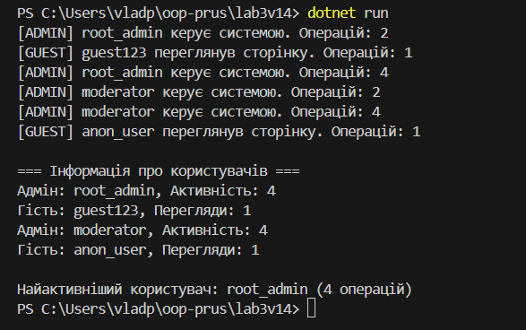

# Лабораторна робота №3: Наслідування: основи

**Тема:** Наслідування: основи
**Мета:** Закріпити знання про базові класи, похідні класи, модифікатори доступу, використання `base`, поліморфізм у простій формі.

---

## Опис виконання завдання

Завдання було виконано шляхом створення ієрархії класів у мові C#:

1.  **Базовий клас:** `User` (абстрактний).
    * Містить приватне поле `_login` (доступ через властивість `Login`) та захищене поле `operationsCount`.
    * Реалізовано **конструктор** із ініціалізацією полів.
    * Визначено **абстрактний метод** `PerformAction(string actionDescription)`.
    * Визначено **віртуальний метод** `DisplayUserInfo()`.
    * Додано **деструктор** (`~User()`) для демонстрації.

2.  **Похідні класи:** `Admin` та `Guest`.
    * Кожен клас має свій **конструктор**, який **викликає конструктор базового класу** за допомогою синтаксису `base(...)`.
    * **Перевизначено** (`override`) методи `PerformAction` (реалізація абстрактного) та `DisplayUserInfo` (реалізація віртуального). У перевизначеному `DisplayUserInfo` використовується **`base.DisplayUserInfo()`** для виклику базової реалізації.
    * Кожен клас імплементує свою унікальну логіку у `PerformAction` та додає власні поля.

3.  **Демонстрація поліморфізму:**
    * Створено колекцію `List<User>`, що містить об'єкти `Admin` та `Guest`.
    * Виконано ітерацію по цій колекції, викликаючи методи (`PerformAction` та `DisplayUserInfo`). Завдяки поліморфізму, у часі виконання викликаються відповідні **перевизначені** методи похідних класів.

4.  **Обчислення:**
    * Обчислення кількості виконаних операцій реалізовано шляхом інкрементування захищеного поля `operationsCount` у методі `PerformAction` кожного похідного класу.
    * Виявлення користувача з найбільшою активністю виконано за допомогою LINQ (`OrderByDescending`) на колекції об'єктів `User`.

Ключові частини коду супроводжуються **коментарями**.

---

## Приклади запуску (Скріншот виводу програми)
