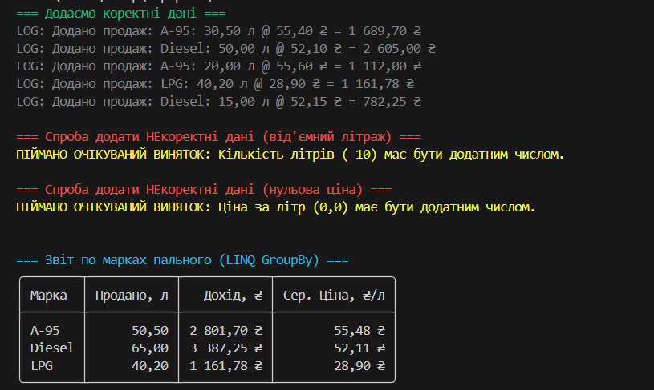

# Лабораторна робота №5

## Тема: Узагальнені типи (Generics), колекції і LINQ, обробка винятків

### Варіант 14: Пальне на АЗС (FuelPump/Sale)

Цей проєкт є консольним застосунком, що моделює роботу АЗС. Головний клас `FuelPump` агрегує (містить) посилання на узагальнений репозиторій `IRepository<Sale>` і дозволяє реєструвати продажі пального (`Sale`) та виводити статистику.

---

## ✅ Що було реалізовано (Вимоги)

1.  **Узагальнені типи (Generics):**
    * Створено узагальнений інтерфейс `IRepository<T>`, що описує базові CRUD-операції.
    * Створено узагальнений клас `Repository<T>`, який реалізує цей інтерфейс, використовуючи `List<T>` для зберігання даних.
    * У `Program.cs` цей репозиторій використовується з конкретним типом: `IRepository<Sale> salesRepository = new Repository<Sale>();`.

2.  **Композиція / Агрегація:**
    * Реалізовано **агрегацію**: клас `FuelPump` має приватне поле `IRepository<Sale>`, яке він отримує через конструктор (Dependency Injection). `FuelPump` використовує репозиторій для збереження даних про продажі.

3.  **Контроль вхідних даних та Власні винятки:**
    * У конструкторі моделі `Sale` реалізовано валідацію: літраж (`Liters`) та ціна (`PricePerLiter`) не можуть бути нульовими або від'ємними.
    * Створено власний клас винятку `InvalidSaleException`, який наслідується від `Exception`.
    * Якщо валідація в конструкторі `Sale` не проходить, "кидається" (`throw`) виняток `InvalidSaleException` з відповідним повідомленням.

4.  **Обробка винятків (try-catch):**
    * У головному методі `Main` продемонстровано обробку помилок. Спроби додати некоректні дані (наприклад, `pump1.MakeSale("A-92", -10.0, 50.00m);`) обгорнуті в блок `try-catch`.
    * Блок `catch` "ловить" `InvalidSaleException` і коректно виводить повідомлення про помилку, не даючи програмі "впасти".

5.  **Колекції та LINQ:**
    * Клас `Repository<T>` використовує узагальнену колекцію `List<T>`.
    * Метод `FuelPump.PrintSalesSummaryByBrand()` використовує **LINQ** для обчислення статистики (вимога лаби):
        * `GroupBy(sale => sale.Brand)`: групує всі продажі за маркою пального.
        * `Sum(sale => sale.Liters)`: обчислює сумарний літраж для кожної групи.
        * `Sum(sale => sale.TotalAmount)`: обчислює сумарний дохід для кожної групи.
        * Розраховується **середня ціна** за літр (`TotalRevenue / TotalLiters`).
        * Результат сортується за допомогою `OrderBy()`.

6.  **(Опційно) UI - Spectre.Console:**
    * Для виводу фінального звіту використовується бібліотека `Spectre.Console`, яка малює гарну таблицю в терміналі.

---

## Приклад виводу

## Контрольні запитання

**1. Що таке generics? Які їхні переваги?**

**Generics (узагальнення)** – це механізм, що дозволяє створювати класи, методи та інтерфейси з "заповнювачем" (placeholder, зазвичай `<T>`) для типу даних. Конкретний тип вказується під час створення екземпляра.

*Переваги:*
1.  **Безпека типів (Type Safety):** Компілятор контролює, що у `List<string>` можна додати лише `string`. Це виключає помилки `InvalidCastException` під час виконання, які були типові для `ArrayList`.
2.  **Продуктивність:** При роботі з типами-значеннями (`int`, `struct`) узагальнення уникають "упаковки" (boxing) та "розпакування" (unboxing) – повільного процесу перетворення в `object` і назад.
3.  **Повторне використання коду:** Ми пишемо `Repository<T>` один раз і можемо використовувати його для `Repository<Sale>`, `Repository<User>` тощо.

**2. Які основні відмінності між `ArrayList` і `List<T>`?**

| Характеристика | `ArrayList` (Застарілий) | `List<T>` (Сучасний) |
| :--- | :--- | :--- |
| **Простір імен** | `System.Collections` | `System.Collections.Generic` |
| **Типізація** | Нетипізований. Зберігає все як `object`. | Типізований (Generic). `T` визначає тип. |
| **Безпека типів** | **Відсутня.** Можна покласти `int` і `string` в одну колекцію. | **Гарантована.** `List<int>` прийме лише `int`. |
| **Продуктивність** | **Низька** (для value-types) через boxing/unboxing. | **Висока.** Boxing не відбувається. |

**3. Чим відрізняється `Dictionary<TKey,TValue>` від `List<T>`?**

* `List<T>` (Список): Це **впорядкована колекція** елементів. Доступ до елементів відбувається за **числовим індексом** (`myList[0]`). Пошук елемента за значенням – повільна операція (O(n)).
* `Dictionary<TKey,TValue>` (Словник): Це **невпорядкована колекція** пар "ключ-значення". Доступ до значення (`TValue`) відбувається за **унікальним ключем** (`TKey`) – (`myDict["myKey"]`). Пошук за ключем – дуже швидка операція (O(1)).

**4. У чому перевага LINQ над класичними циклами?**

**LINQ (Language-Integrated Query)** – це декларативний підхід до роботи з даними.
* **Декларативність:** Ми описуємо, *ЩО* ми хочете отримати, а не *ЯК* це зробити (на відміну від імперативних циклів `for`/`foreach`).
* **Читабельність і компактність:** Код `data.Where(x => x > 10).Sum();` набагато коротший і зрозуміліший, ніж цикл `foreach` з `if` та змінною-акумулятором.
* **Універсальність:** Один і той самий синтаксис LINQ працює з різними джерелами: об'єктами в пам'яті (LINQ to Objects), базами даних (LINQ to SQL/Entities), XML (LINQ to XML).

**5. Як працює ключове слово `finally`?**

Блок `finally` є частиною конструкції `try-catch-finally`.
Його головна риса – **код у блоці `finally` виконується гарантовано** (майже завжди), незалежно від того, що сталося в `try-catch`:
1.  Якщо `try` завершився успішно (без винятків).
2.  Якщо `try` "кинув" виняток, і `catch` його "зловив".
3.  Якщо `try` "кинув" виняток, але `catch` його *не* "зловив" (і виняток "летить" вище по стеку).

Він використовується для "очищення" ресурсів: закриття файлів (`file.Close()`) або з'єднань з БД (`connection.Close()`).

**6. Коли доцільно створювати власні класи винятків?**

Доцільно, коли стандартні винятки (`ArgumentException`, `InvalidOperationException` тощо) **недостатньо чітко описують** бізнес-проблему.
* **Для специфічної обробки:** Ми можемо написати `catch (InvalidSaleException ex)`, щоб "зловити" *тільки* нашу помилку, і проігнорувати, наприклад, `OutOfMemoryException`.
* **Для семантики:** Назва `InvalidSaleException` одразу дає зрозуміти, що пішло не так, на відміну від загального `ArgumentException`.
* **Для додавання даних:** У власний виняток можна додати властивості (наприклад, `public string FailedBrand { get; }`), щоб передати більше контексту про помилку в блок `catch`.